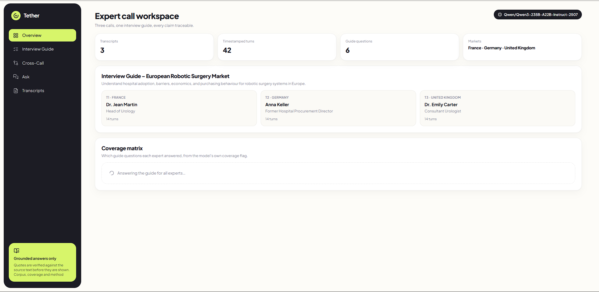

# Tether

<div align="center">
  
</div>

<div align="center">
  
</div>

## About The Project

Expert-network calls are how market researchers find out what is really happening in an
industry. You pay a surgeon or a procurement director for an hour of their time, ask them a
fixed list of questions, and get back a transcript. Then somebody has to actually read all of
them and write up what was said.

Tether does that reading. Point it at a folder of transcripts and an interview guide, and it
answers every guide question for every expert, pulls the quotes that back each answer, shows
the timestamp where the words appear, and lines the experts up against each other to show
where they agree and where they do not.

The whole thing is built around one worry. Language models invent quotes. A fabricated quote
in a research deliverable is not a small bug — it is the kind of thing that costs a firm a
client. So Tether does not trust the model's citations. Every quote gets checked against the
source transcript character by character before it reaches the screen, and anything that
fails is thrown out and counted. The counter is printed under every result, including when
it is not zero. During testing the model paraphrased "15 to 20 percent" as "15–20%" and six
citations were binned for it, which is exactly the point.

If you have no API key, the app still runs. It drops into an extractive mode that retrieves
real passages and refuses to generate anything, and it says so in the header rather than
pretending.

### Key Features

- **Guide answers per expert** — all six questions, answered from that expert's transcript only
- **Verbatim quotes with timestamps** — click any timestamp and land on that line of the transcript
- **Citation verification** — quotes are re-matched against the source; failures are dropped and counted
- **Cross-call comparison** — shared themes and genuine disagreements, each needing evidence from two or more experts
- **Ask anything** — free-text questions answered across all transcripts, with citations
- **Honest fallback** — no key means retrieval-only output, clearly labelled, never invented
- **Coverage matrix** — at a glance, which expert actually addressed which question
- **Provider-agnostic** — any OpenAI-compatible endpoint: HuggingFace, OpenRouter, Ollama, Groq, vLLM

## Built With

### Frontend

- React 18 + TypeScript
- Vite
- Tailwind CSS
- lucide-react for icons

No component library. The UI is small enough that hand-written components were less work than
fighting someone else's defaults.

### Backend

- Node 20 + Express 5
- TypeScript, strict mode
- BM25 retrieval, written by hand — deterministic, no index to warm, no vector database
- Qwen3-235B-A22B-Instruct via HuggingFace Inference Providers (swap the model in one env var)

## Prerequisites

- Node 20 or newer
- An API key for any OpenAI-compatible inference endpoint — optional, but without one the app
  runs retrieval-only

## Installation

```bash
git clone <your-repo-url> tether
cd tether
npm install
```

Copy the example environment file and fill in a key:

```bash
cp .env.example .env
```

```env
OPENAI_BASE_URL=https://router.huggingface.co/v1
OPENAI_API_KEY=hf_your_token_here
OPENAI_MODEL=Qwen/Qwen3-235B-A22B-Instruct-2507
```

The HuggingFace token needs the "Make calls to Inference Providers" permission, or every
request comes back 403. Other endpoints work the same way — swap the three values:

```env
# OpenRouter
OPENAI_BASE_URL=https://openrouter.ai/api/v1
OPENAI_MODEL=openai/gpt-oss-120b

# Fully local, no key, no network
OPENAI_BASE_URL=http://localhost:11434/v1
OPENAI_MODEL=gpt-oss:20b
```

Start it:

```bash
npm run dev
```

API on `:8787`, web on `:5173`.

| Command                               | What it does                                   |
| ------------------------------------- | ---------------------------------------------- |
| `npm run dev`                         | both halves together                           |
| `npm run dev:api` / `npm run dev:web` | one at a time                                  |
| `npm run verify`                      | 28 offline checks — no key or network needed   |
| `npm run typecheck`                   | strict TypeScript across all workspaces        |
| `npm run build`                       | production build                               |
| `npm run check`                       | everything CI runs                             |
| `npm run precompute`                  | freeze answers (only for timeout-capped hosts) |
| `npm run precompute`                  | freeze current answers for deployment          |

`npm run verify` is worth running first. It parses deliberately broken transcripts, tries to
sneak fabricated quotes past the verifier, and scores retrieval against a hand-labelled key.
It takes about two seconds and needs nothing from the network.

Drop new transcripts into `data/transcripts/` and restart. Nothing else is hardcoded.

## Deployment

Configured for **Render** (`render.yaml`) and **Vercel** (`vercel.json`). Render is the better
fit — it has no request timeout, and this app makes model calls that run for a minute or more.

Before deploying, run `npm run precompute`. It copies locally computed answers into
`data/precomputed/`, which ships with the deployment and is served as a read-only cache, so
the demo is instant and cannot time out mid-call. New questions typed into Ask still hit the
model.

Step-by-step for both platforms, including the environment variables and what breaks on each:
[docs/DEPLOY.md](docs/DEPLOY.md).

## Deployment

Configured for **Render** (`render.yaml`) and **Vercel** (`vercel.json`). Use Render: it has
no request timeout, so every pipeline calls the model live, including the cross-call analysis
that takes around two minutes. Vercel's Hobby tier cuts a request off at 60 seconds and would
kill that one.

Step-by-step for both, with the environment variables and what breaks where:
[docs/DEPLOY.md](docs/DEPLOY.md).

## Project Structure

```
tether/
├── apps/
│   ├── api/                       Express API and the analysis pipelines
│   │   └── src/
│   │       ├── corpus.ts          transcripts → timestamped, citable segments
│   │       ├── retrieval.ts       BM25 index with light stemming
│   │       ├── verify.ts          the quote checker everything passes through
│   │       ├── cache.ts           disk cache for fixed work, LRU for questions
│   │       ├── index.ts           routes, validation, rate limiting
│   │       ├── selftest.ts        npm run verify
│   │       ├── providers/         OpenAI-compatible client
│   │       └── pipelines/         guide answers · themes · ask · extractive
│   └── web/                       React client
│       └── src/
│           ├── components/        presentational only, no fetching
│           ├── views/             one per screen, owns its own requests
│           ├── pages/             app shell
│           └── lib/               API client, hooks
├── packages/
│   └── shared/                    types both sides import
├── data/
│   ├── transcripts/               the corpus the API reads
│   └── precomputed/               answers shipped with the deployment
├── docs/
│   ├── AUDIT.md                   full engineering review
│   ├── DEPLOY.md                  Render and Vercel, step by step
│   ├── BRIEF.md                   the original case brief
│   └── case-pack/                 source files, untouched
└── .github/workflows/ci.yml
```

A segment id like `T1:02:18` is the spine of the app. It is the citation key, the retrieval
key, part of the cache key, and the link target. Because the timestamp is baked into the id,
a citation cannot exist without one — the model never gets asked for a timestamp, it gets
looked up.

Types live in `packages/shared` and are imported by both sides, so changing one is a compile
error on the other. An earlier version kept two copies in sync with a script, which works
right up until somebody forgets to run it.

## License

MIT
